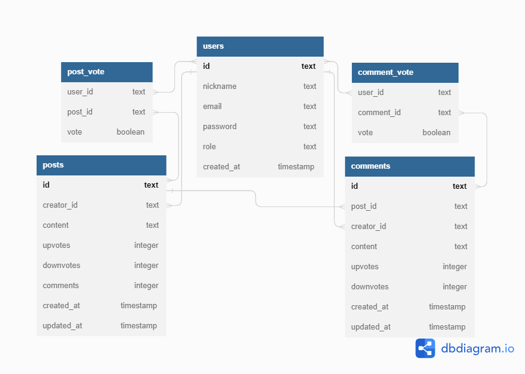

# LabEddit



Este é o backend do LabEddit, projeto de uma rede social proposto pela Labenu ao final do bootcamp de Desenvolvimento Web Full-Stack, Turma Conway, inspirado na Reddit.

Como funciona?
É necessário se cadastrar ou fazer login para então visualizar as postagens.

Posso criar posts?
Sim, você pode criar posts, comentar nos posts de outras pessoas e votar.

Votar, como assim?
Se gostei de um post ou de um comentário posso registrar um upvote, e se não gostei posso registrar um downvote. Os votos não são obrigatórios, vota quem quer.

## Como rodar este projeto?

```
npm install
npm run start
```

## Tecnologias Utilizadas

- NodeJS
- Typescript
- Zod
- SQL e SQLite
- Express
- Knex
- POO
- Arquitetura em camadas
- Geração de UUID
- Geração de hashes
- Bcryptjs
- Autenticação e autorização
- Jsonwebtoken
- Roteamento
- Postman
- Testes unitários da camada business (80%)
- Jest
- Deploy

<!-- FRONTEND
- React
- React Router
- React Context
- Axios
- Styled-components -->

## Escopo do Projeto

- Documentação Postman de todos os endpoints

- Endpoints seguindo as boas práticas HTTP
- [x] Ping
- [x] Signup
- [x] Login
- [x] Get All Users (só para ADMIN)
- [x] Create New Post
- [x] Get All Posts
- [x] Edit Post By Id
- [x] Delete Post By Id
- [x] Create New Comment
- [x] Get Comments By PostId
- [x] Edit Comment
- [x] Delete Comment By Id
- [x] Vote Post By PostId
- [x] Vote Comment By CommentId

- Autenticação e autorização
- [x] identificação UUID
- [x] senhas hasheadas com Bcrypt
- [x] tokens JWT

- Código
- [x] POO
- [x] Arquitetura em camadas
- [x] Roteadores no Express

- README.md


## Documentação

A documentação criada no Postman está [neste link](https://documenter.getpostman.com/view/25826651/2s93sf3rkd).

## Pessoas Autoras


[Eloísa Wuttke Madril](https://www.linkedin.com/in/eloisa-wuttke-madril/)
